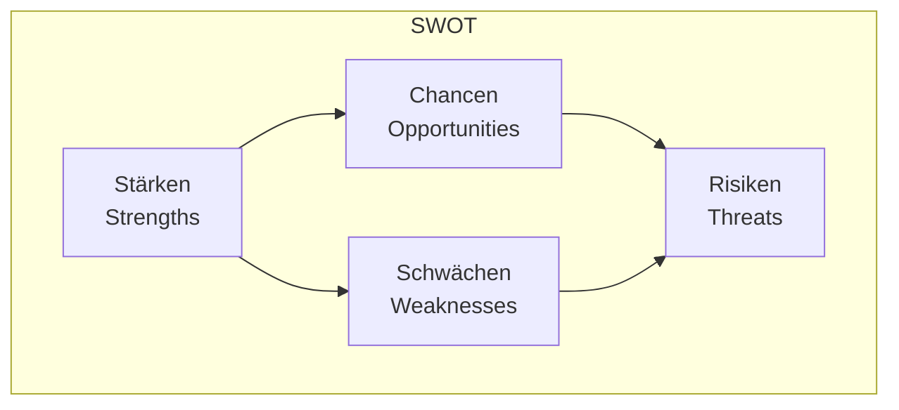

# SWOT Matrix

```mermaid {scale: 0.9}
graph TB
    subgraph SWOT
    A[Stärken<br>Strengths] --> B[Schwächen<br>Weaknesses]
    C[Chancen<br>Opportunities] --> D[Risiken<br>Threats]
    A --> C
    B --> D
    end
```
