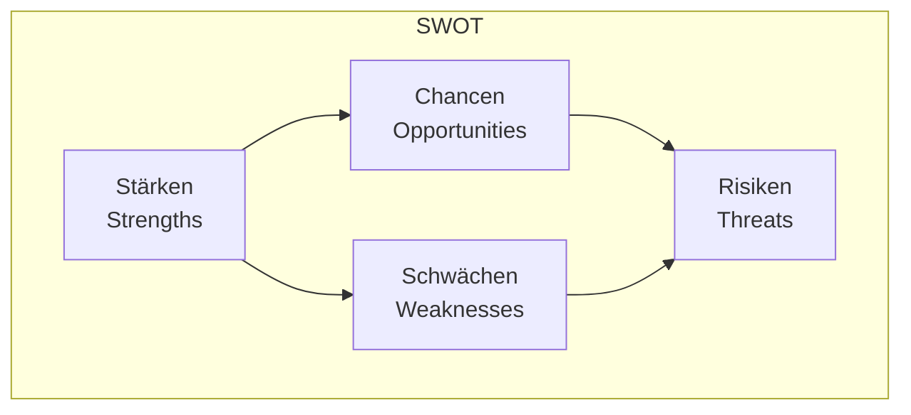

# SWOT-Analyse

Strategisches Planungswerkzeug für Unternehmen und Projekte

  
    Drücken Sie die Leertaste für die nächste Seite <carbon:arrow-right class="inline"/>
  

---

---
transition: fade-out
---

# Was ist SWOT?

SWOT steht für:

<v-clicks>

- **S**trengths (Stärken)
- **W**eaknesses (Schwächen)
- **O**pportunities (Chancen)
- **T**hreats (Risiken)

</v-clicks>

## Zweck

Die SWOT-Analyse hilft Unternehmen und Projekten:

- Aktuelle Situation zu bewerten
- Strategische Entscheidungen zu treffen
- Risiken zu identifizieren
- Chancen zu nutzen

---

---
layout: two-cols
---

# Interne Faktoren

<v-clicks>

## Stärken (Strengths)

- Positive interne Eigenschaften
- Vorteile gegenüber Wettbewerbern
- Verfügbare Ressourcen
- Unique Selling Points (USPs)

## Schwächen (Weaknesses)

- Negative interne Eigenschaften
- Verbesserungspotenziale
- Ressourcenmängel
- Wettbewerbsnachteile

</v-clicks>

::right::

# Externe Faktoren

<v-clicks>

## Chancen (Opportunities)

- Positive externe Möglichkeiten
- Marktpotenziale
- Technologische Entwicklungen
- Gesellschaftliche Trends

## Risiken (Threats)

- Negative externe Einflüsse
- Wettbewerbsdruck
- Markthindernisse
- Regulatorische Änderungen

</v-clicks>

---

---
layout: center
---

# SWOT Matrix

---

---
layout: default
---

# Praktisches Beispiel: E-Commerce Start-up

  

  ### Stärken

  - Innovative Technologieplattform
  - Erfahrenes Entwicklerteam
  - Agile Arbeitsweise
  - Starke UX/UI-Design-Kompetenz

  

  

  ### Schwächen

  - Begrenzte finanzielle Ressourcen
  - Noch keine etablierte Marke
  - Kleines Vertriebsteam
  - Begrenzte Produktpalette

  

  

  ### Chancen

  - Wachsender E-Commerce Markt
  - Zunehmende Digitalisierung
  - Neue Technologietrends (AR/VR)
  - Internationale Expansionsmöglichkeiten

  

  

  ### Risiken

  - Starke Konkurrenz
  - Cybersecurity-Bedrohungen
  - Wirtschaftliche Unsicherheit
  - Sich ändernde Datenschutzvorschriften

  

---

---
layout: section
---

# Anwendung der SWOT-Analyse

<v-clicks>

1. **Vorbereitung**

   - Team zusammenstellen
   - Relevante Daten sammeln
   - Analysezeitraum festlegen

2. **Durchführung**

   - Brainstorming zu allen vier Bereichen
   - Priorisierung der Punkte
   - Dokumentation der Ergebnisse

3. **Auswertung**

   - Zusammenhänge identifizieren
   - Strategien entwickeln
   - Maßnahmen ableiten

4. **Umsetzung**
   - Aktionsplan erstellen
   - Verantwortlichkeiten zuweisen
   - Regelmäßige Überprüfung

</v-clicks>

---

---
layout: default
---

# Vorteile der SWOT-Analyse

  

  ## Einfachheit

  - Leicht verständlich
  - Schnell anwendbar
  - Flexibel einsetzbar
  - Keine speziellen Tools nötig

  

  

  ## Nutzen

  - Ganzheitlicher Überblick
  - Basis für Strategien
  - Risikobewertung
  - Entscheidungshilfe

  

## Tipps für erfolgreiche Analyse

1. Ehrlich und objektiv bleiben  
2. Konkret und spezifisch sein  
3. Aktuelle Daten verwenden  
4. Regelmäßig aktualisieren  
5. Team-Input einbeziehen

---

---
layout: end
---

# Vielen Dank!

[Dokumentation](https://example.com) · [Weitere Ressourcen](https://example.com)
